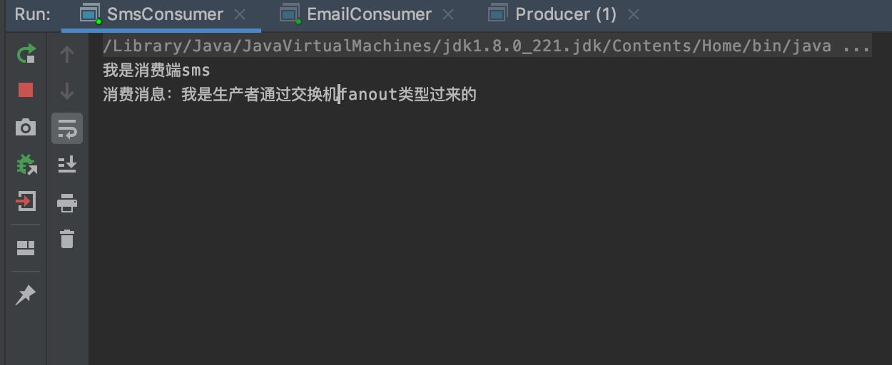
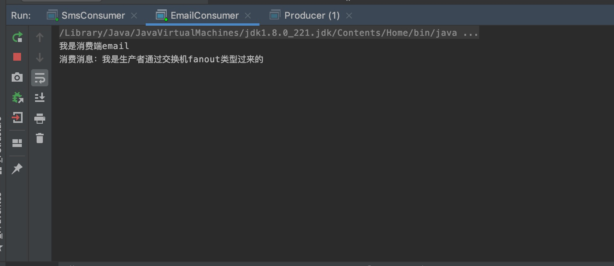
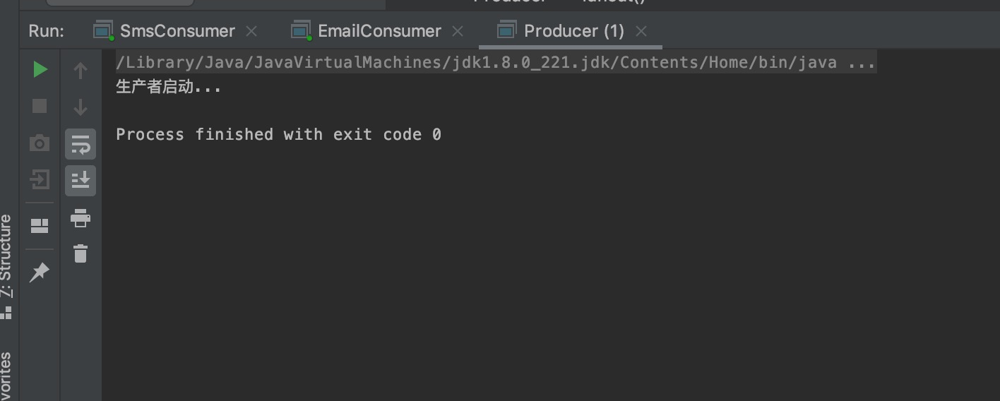
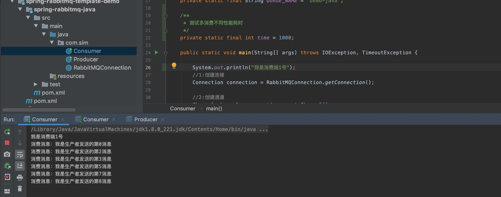
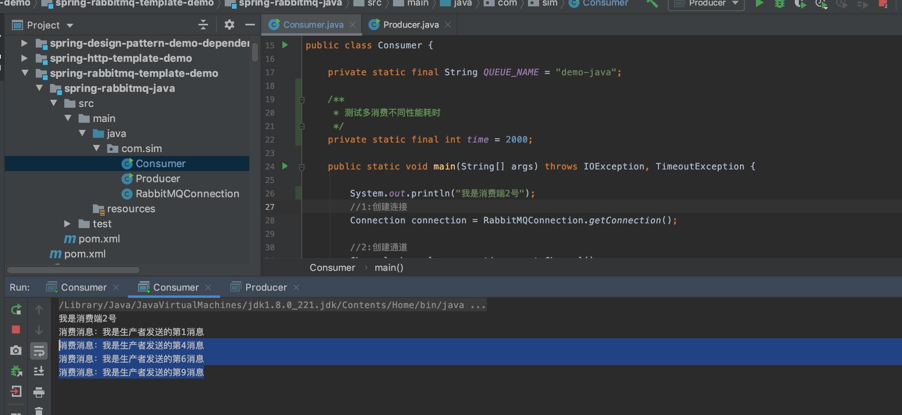
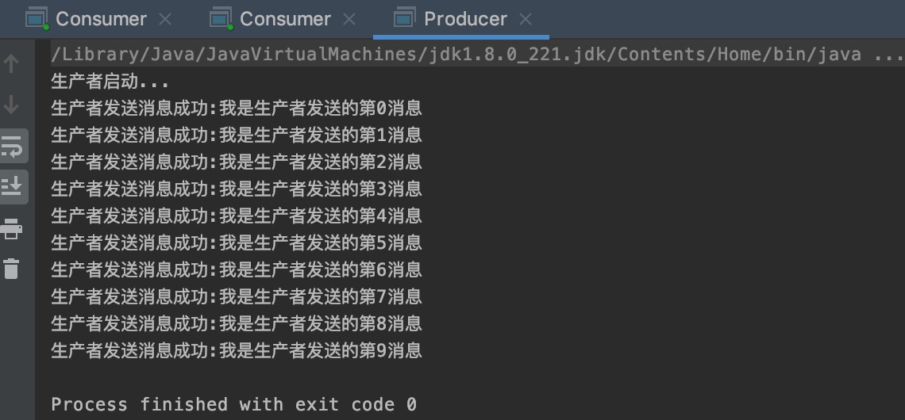

## 交换机模式
### fanout

+ 生产者重点代码
>    channel.exchangeDeclare(EXCHANGE_NAME,"fanout",true);
>    channel.basicPublish(EXCHANGE_NAME,"",null,msg.getBytes());

+ 消费者重点代码
>   绑定队列到交换机
>   channel.queueBind(QUEUE_NAME,EXCHANGE_NAME,"");

### 采用手动签收消息机制，实现根据服务器处理效率来派发消息，能者多劳

> channel.basicQos(1);
>
> channel.basicAck(envelope.getDeliveryTag(),false);
## 1号消费者，表示性能较好的服务层

## 1号消费者，表示性能较差的服务层

## 生产消息

